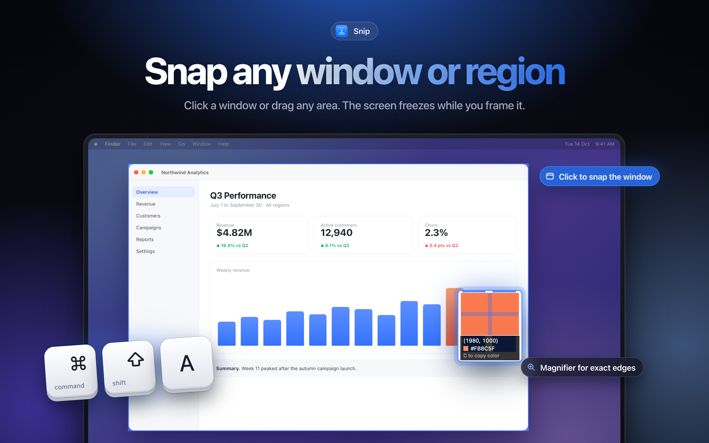

# Snip

Lark-style screenshots for Mac. Press **⌘⇧A**.



Lives in the menu bar.

## Features

- Freezes all displays, then dims everything except the window under the cursor (click to grab that window, or drag any region)
- Magnifier with pixel coordinates and color; press **C** to copy the hex
- Resize with 8 handles, drag to move, arrow keys nudge (Shift = 10px)
- Annotate: rectangle, ellipse, arrow, pen, mosaic, text, numbered markers; 3 sizes, 6 colors; Shift constrains shapes/arrow angle
- Undo (⌘Z), extract text via on-device OCR, pin to screen, save PNG (⌘S)
- **Enter / double-click / ⌘C** copies to clipboard, **Esc** cancels, right-click resets the selection

Pinned images: drag to move, scroll to zoom, right-click for Copy/Save/Close, double-click or Esc to close.

## Build

```sh
./build.sh            # builds build/Snip.app
./build.sh --install  # installs to /Applications and launches
```

Requires macOS 14+. On first launch the app opens a setup window that deep-links to System Settings → Privacy & Security → Screen & System Audio Recording, shows live whether access is granted, and offers a one-click relaunch (macOS only applies the grant after relaunch). Reopen it anytime from the menu bar: **Screen Recording Permission…**. The app is signed with your Apple Development identity so the grant survives rebuilds.

Scripts can trigger a capture by posting the distributed notification `com.anup.snip.capture`.

Submitted to the Mac App Store as **Snip: Screenshot & Markup** (in review).

App Store screenshots (2880×1800) are in `Marketing/appstore-v2/`, built from HTML in `Marketing/html/`. Re-render with `Marketing/html/render.sh` (add `raw` to regenerate the overlay renders first). The first-generation set is in `Marketing/appstore/`. Listing copy and the submission checklist are in `Marketing/APP_STORE.md`.
