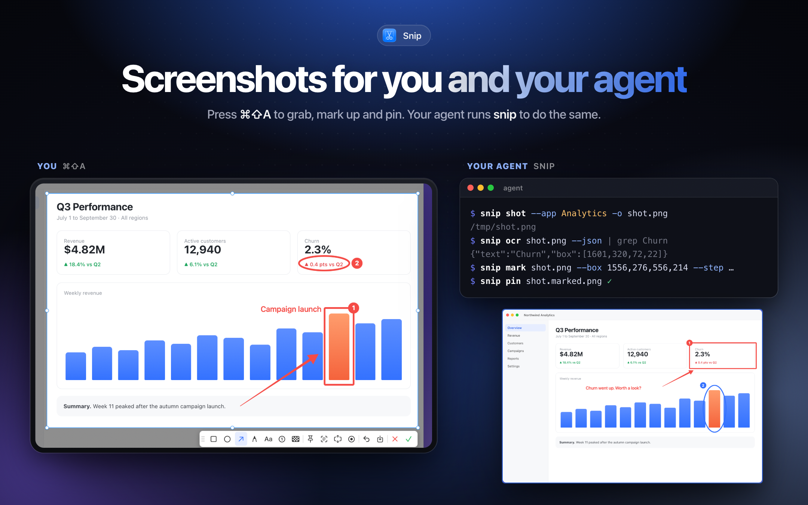
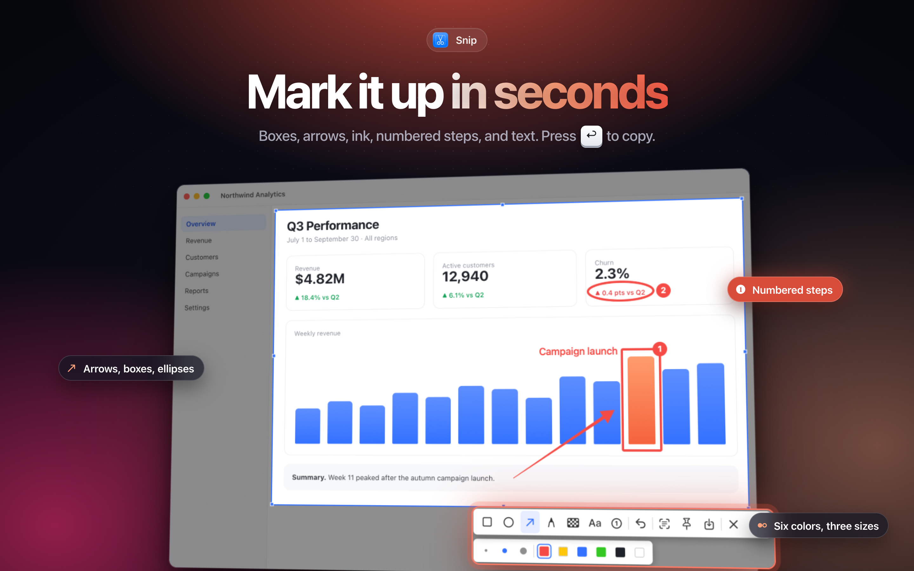
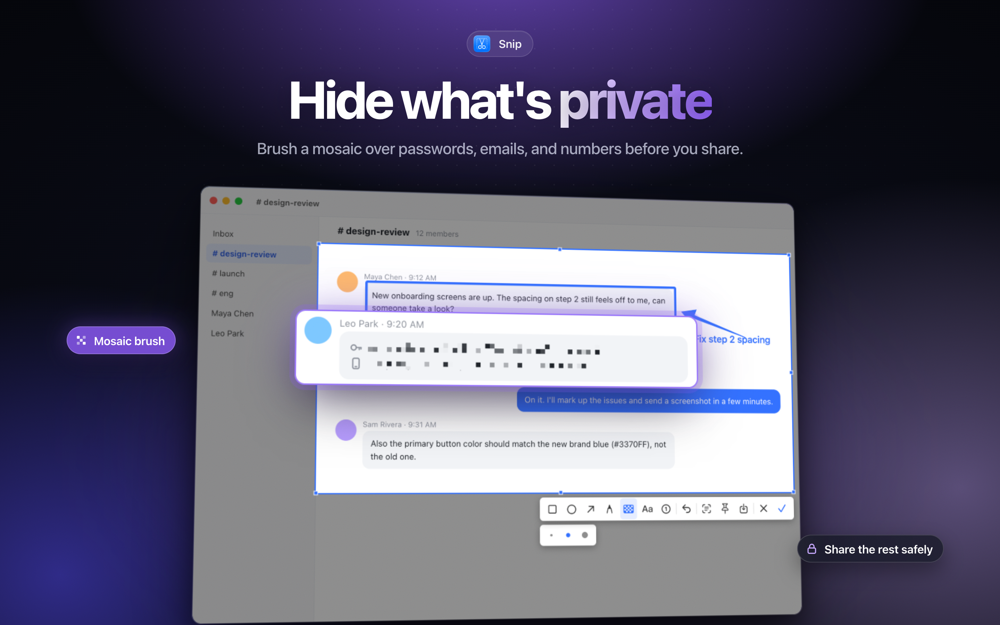
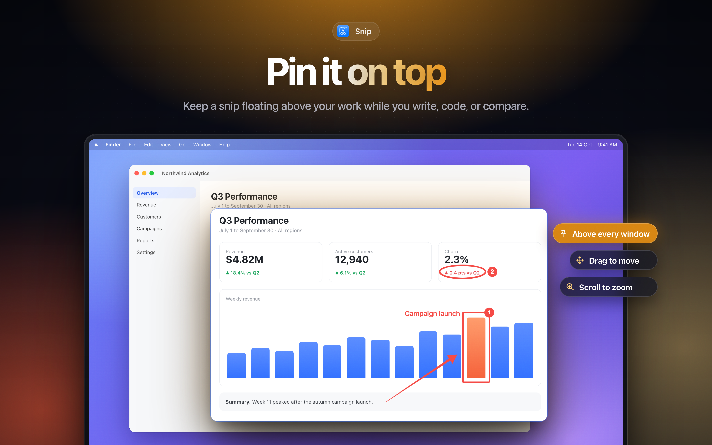
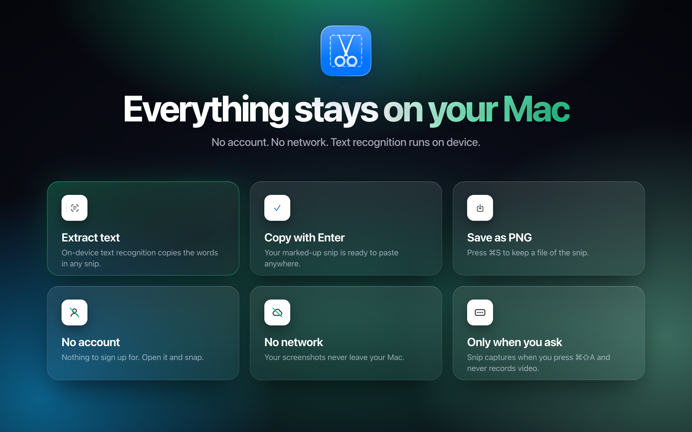
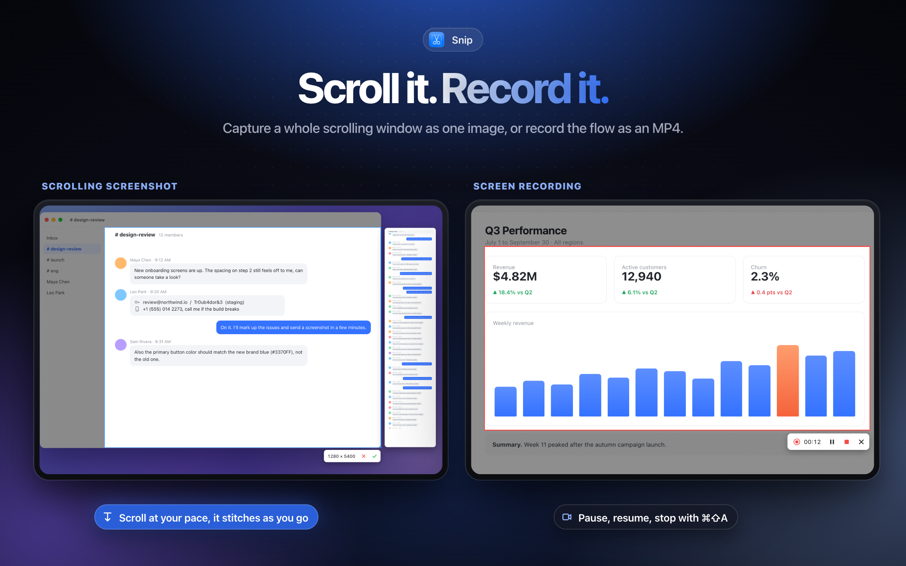
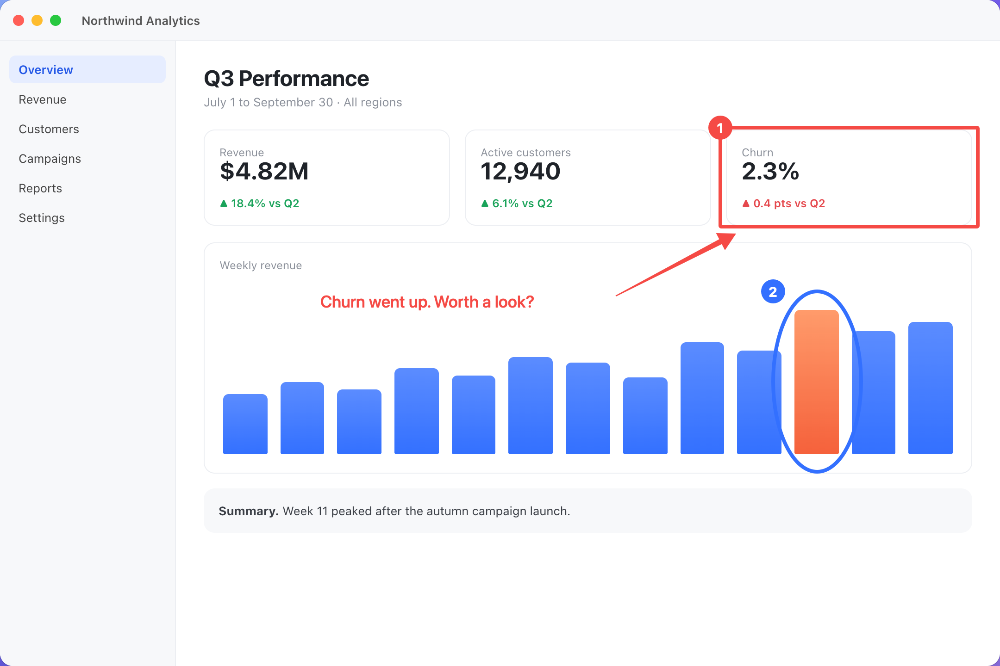

<p align="center">
  
</p>

<h1 align="center">Snip</h1>

<p align="center">
  <b>Screenshots for you and your agent.</b><br>
  Press <kbd>⌘</kbd> <kbd>⇧</kbd> <kbd>A</kbd> to snap, mark up, scroll, record, and pin.<br>
  Your coding agent runs <code>snip</code> to do the same from the terminal.
</p>

<p align="center">
  
  
  
  
  <a href="https://github.com/anup-a/snip/releases/latest"></a>
  
</p>

<p align="center">
  <a href="Marketing/readme/assets/demo.mp4"></a><br>
  <sub><a href="Marketing/readme/assets/demo.mp4">Watch in full quality (MP4)</a></sub>
</p>

## For you and your agent

<p align="center">
  
</p>

<table>
  <tr>
    <th width="50%">You press <kbd>⌘</kbd> <kbd>⇧</kbd> <kbd>A</kbd></th>
    <th width="50%">Your agent runs <code>snip</code></th>
  </tr>
  <tr>
    <td valign="top">
      Click a window or drag a region.<br>
      Box it, arrow it, number the steps, blur the secrets.<br>
      Scroll for one long image, or record an MP4.<br>
      <kbd>Enter</kbd> copies it. Or pin it above everything.
    </td>
    <td valign="top">
      <code>snip shot --app Safari</code> to see what you see.<br>
      <code>snip scroll --app Slack</code> for the whole thread.<br>
      <code>snip ocr</code> finds the words, with pixel boxes.<br>
      <code>snip mark</code> and <code>snip pin</code> to point you at the problem.
    </td>
  </tr>
</table>

Same app, same stitching, same markup style. [Set up the CLI](#for-agents) in one command.

## Why

If you've used the screenshot tool in Lark, you know the flow: one hotkey, the screen freezes, you click the window you want, draw a box and an arrow, and hit Enter. It's on your clipboard before you've thought about it.

Snip brings that flow to the Mac as a tiny native menu bar app. There's no Electron, no account, and no uploads. Then it hands the same tools to your coding agent, so it can look at your screen and show you what it means instead of describing it.

## Features

<table>
  <tr>
    <td width="50%"></td>
    <td width="50%"></td>
  </tr>
  <tr>
    <td><b>Mark it up.</b> Rectangles, ellipses, arrows, freehand ink, text, and numbered steps. Six colors, three sizes. Hold Shift to keep shapes even and arrows straight.</td>
    <td><b>Hide what's private.</b> Brush a mosaic over passwords, emails, and account numbers before you share.</td>
  </tr>
  <tr>
    <td width="50%"></td>
    <td width="50%"></td>
  </tr>
  <tr>
    <td><b>Pin it on top.</b> Float a snip above your other windows while you write, code, or compare. Drag to move, scroll to zoom.</td>
    <td><b>Stays on your Mac.</b> Text recognition runs on device with Apple's Vision framework. Snip makes no network requests.</td>
  </tr>
</table>

<p align="center">
  
</p>

**Scroll it. Record it.** Select a region and press the scroll button: scroll at your own pace and Snip stitches one long image as you go, keeping sticky headers and sidebars out of the middle. Or press record for an MP4 of any region, with pause, resume, and <kbd>⌘</kbd> <kbd>⇧</kbd> <kbd>A</kbd> to stop.

Also included:

- **Smart window snapping.** Every display freezes and the window under the cursor lights up. Click to grab it, or drag any region.
- **Pixel-exact framing.** A magnifier shows coordinates and color. Press <kbd>C</kbd> to copy the hex value.
- **Adjustable selection.** Eight resize handles, drag to move, and arrow keys to nudge by 1 px (10 px with Shift).
- **Extract text.** On-device OCR copies the words in any snip.
- **Scrolling screenshots.** Select a region, press the scroll button, and scroll. Snip stitches one long image and handles sticky headers, footers, and sidebars.
- **Screen recording.** Record any region to MP4, with pause. Snip's own controls stay out of the video.
- **Save or copy.** Save a PNG with <kbd>⌘</kbd> <kbd>S</kbd>, or copy with <kbd>Enter</kbd>.

## Keyboard shortcuts

| While capturing | |
| --- | --- |
| <kbd>⌘</kbd> <kbd>⇧</kbd> <kbd>A</kbd> | Start a capture from anywhere |
| Click | Snap the highlighted window |
| Drag | Select a region |
| <kbd>C</kbd> | Copy the color under the cursor |
| <kbd>←</kbd> <kbd>→</kbd> <kbd>↑</kbd> <kbd>↓</kbd> | Nudge the selection (hold <kbd>⇧</kbd> for 10 px) |
| <kbd>Shift</kbd> while drawing | Even shapes, straight arrows |
| <kbd>⌘</kbd> <kbd>Z</kbd> | Undo |
| <kbd>Enter</kbd>, <kbd>⌘</kbd> <kbd>C</kbd>, or double-click | Copy to clipboard and finish |
| <kbd>⌘</kbd> <kbd>S</kbd> | Save as PNG |
| Right-click | Reset the selection |
| <kbd>Esc</kbd> | Cancel |

| Pinned snips | |
| --- | --- |
| Drag | Move |
| Scroll | Zoom |
| <kbd>⌘</kbd> <kbd>C</kbd> / <kbd>⌘</kbd> <kbd>S</kbd> | Copy / Save |
| Right-click | Copy, Save, Close |
| Double-click or <kbd>Esc</kbd> | Close |

## Install

**Download:** grab **Snip-1.0.0.dmg** from the [latest release](https://github.com/anup-a/snip/releases/latest). It's a universal build (Apple silicon and Intel, macOS 14+), signed with Developer ID and notarized by Apple. Open it and drag Snip to Applications.

**Mac App Store:** submitted as *Snip: Screenshot & Markup*. The link will be added here once it's approved.

**Build from source** (requires macOS 14+ and Xcode or the Swift toolchain):

```sh
git clone https://github.com/anup-a/snip.git
cd snip
./build.sh            # builds build/Snip.app
./build.sh --install  # copies it to /Applications and launches it
```

`build.sh` signs with your Apple Development identity, so the Screen Recording permission survives rebuilds.

### First launch

Snip needs **Screen Recording** permission, like every screenshot app on macOS. On first launch a setup window links straight to *System Settings → Privacy & Security → Screen & System Audio Recording*, shows live when access is granted, and offers a one-click relaunch (macOS only applies the permission after a relaunch). You can reopen it any time from the menu bar with **Screen Recording Permission…**.

The menu bar item also has **Take Screenshot** and **Launch at Login**.

## Privacy

Snip captures only when you ask it to, and records video only after you press Record. Screenshots, annotations, and recognized text stay on your Mac. There's no analytics, no account, and no network access. The App Store build runs in the App Sandbox. See the [privacy policy](https://creatica.app/apps/snip/privacy).

## For agents

`snip` is the same capture, stitching, recording, and markup as a command-line tool, so coding agents (Claude Code, Codex, Cursor, anything with a shell) can see your screen and show you things.

<p align="center">
  <br>
  <sub>Marked up by an agent with <code>snip mark</code>.</sub>
</p>

```sh
./install-cli.sh                                  # installs ~/.local/bin/snip
snip shot --app Safari                            # screenshot a window
snip scroll --app Slack                           # the whole scrolling window, one long image
snip record --app "My App" --background           # start a video; `snip stop` ends it
snip ocr shot.png --json                          # text with pixel boxes
snip mark shot.png --box 120,340,400,90 --step 140,360 --text 600,360,"This one"
snip pin shot.marked.png                          # float it on your screen
```

Every command prints the file it wrote (`--json` for details). `snip help` lists every flag. Agents learn the tool from [`skills/snip/SKILL.md`](skills/snip/SKILL.md); with the skills CLI: `npx skills add anup-a/snip`.

The command-line tool needs Screen Recording permission for your terminal, and Accessibility for `snip scroll`.

Scripts can also open the app's capture by posting the distributed notification `com.anup.snip.capture`:

```swift
DistributedNotificationCenter.default().post(name: .init("com.anup.snip.capture"), object: nil)
```

## Speed

Agents take a lot of screenshots, each one a fresh process, so `snip shot` is built to be quick. Median of 20 rounds at native Retina resolution, every tool run once per round in shuffled order:

| | `snip` 0.2 | `screencapture` | python `mss` | Peekaboo 4.9 |
| --- | --- | --- | --- | --- |
| Full screen | **376 ms** | 775 ms | 693 ms (1x only) | 1,127 ms |
| Region | **291 ms** | 611 ms | 499 ms (1x only) | 1,017 ms |
| Window | **453 ms** | 827 ms | not supported | 5,527 ms |

Apple M1, macOS 27, 2880×1800 display. The Mac was busy during the run (load average 25 to 60), so every number is high, but the order held in every run. On an idle Mac a full-screen `snip shot` takes about 200 ms. Measure your own Mac with `python3 Benchmarks/bench.py`.

Where the time went:

- No app setup. `snip` never starts an AppKit app for a screenshot.
- Screens and regions come straight from ScreenCaptureKit's rect capture, without listing every window first.
- Windows use CoreGraphics' window capture, which skips the session ScreenCaptureKit sets up for each new process (with a ScreenCaptureKit fallback).
- PNGs are compressed on every core at once. Lossless, and smaller than macOS's own encoder.

## Project layout

```
Sources/SnipKit/          shared by the app and the CLI
  Annotation.swift        shapes, mosaic, text, numbered markers, palette
  Stitcher.swift          joins scrolled frames into one long image
  RegionWriter.swift      writes screen frames to MP4
  PNGEncoder.swift        multi-core PNG encoder
Sources/SnipCLI/          the `snip` command-line tool
Sources/Snip/
  AppDelegate.swift       menu bar item, hotkey, launch at login
  HotKey.swift            global ⌘⇧A registration
  ScreenCapturer.swift    freezes every display
  CaptureSession.swift    one capture from hotkey to output
  OverlayView.swift       selection, window snapping, magnifier, drawing
  Toolbar.swift           tool, color, and size pickers
  Output.swift            clipboard, PNG save, OCR, toasts
  PinWindow.swift         floating pinned snips
  LiveRegion.swift        dimmed region, live control bar, result windows
  ScrollCapture.swift     scrolling screenshot
  ScreenRecorder.swift    region recording
  PermissionWindow.swift  guided Screen Recording setup
  DemoRenderer.swift      renders overlay states for marketing images
Marketing/
  html/                   App Store screenshots as HTML (render.sh)
  appstore-v2/            rendered 2880×1800 screenshots
  readme/                 README images and the demo video as HTML (render.sh)
  APP_STORE.md            store listing copy
skills/snip/SKILL.md      how agents use `snip`
archive.sh                sandboxed Mac App Store build
install-cli.sh            builds and installs `snip`
Benchmarks/bench.py       screenshot CLI benchmark
```

## Not yet

- Snapping to individual buttons or panels inside a window (only whole windows for now)

Issues and pull requests are welcome.

## License

[MIT](LICENSE) © 2026 Anup Aglawe

---

<p align="center"><sub>Not affiliated with Lark or ByteDance. "Lark-style" describes the workflow that inspired Snip.</sub></p>
